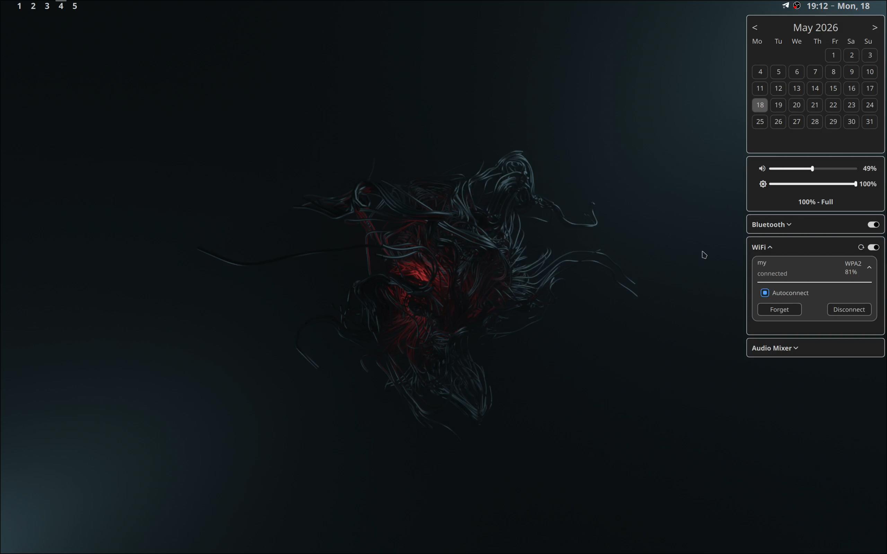

MY ARCH SETUP

## PREVIEW

If you use the feature once a month, you don't need it.

IF YOU STARED THIS REPO YOUR IQ WILL BE LOWER BY 10 POINTS

Required:

- overskride (ui bluetooth)
- nmcli (wi-fi)
- hyprland (0.55 with lua config for workspaces)
- quickshell (0.2.1, maybe it`s will work on a later versions)
- love shit (very important)

top bar have 3 segment:

- workspaces
- audio/music
- clock

click on the clock to open the side panel
