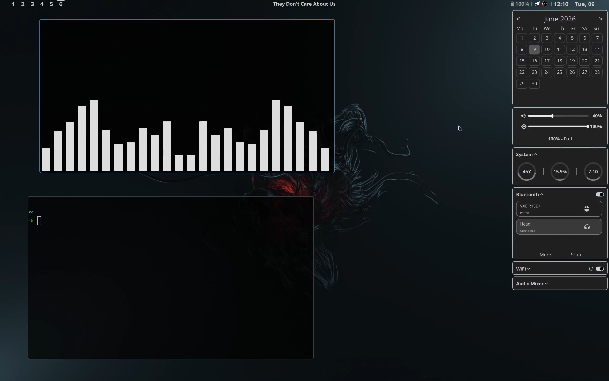
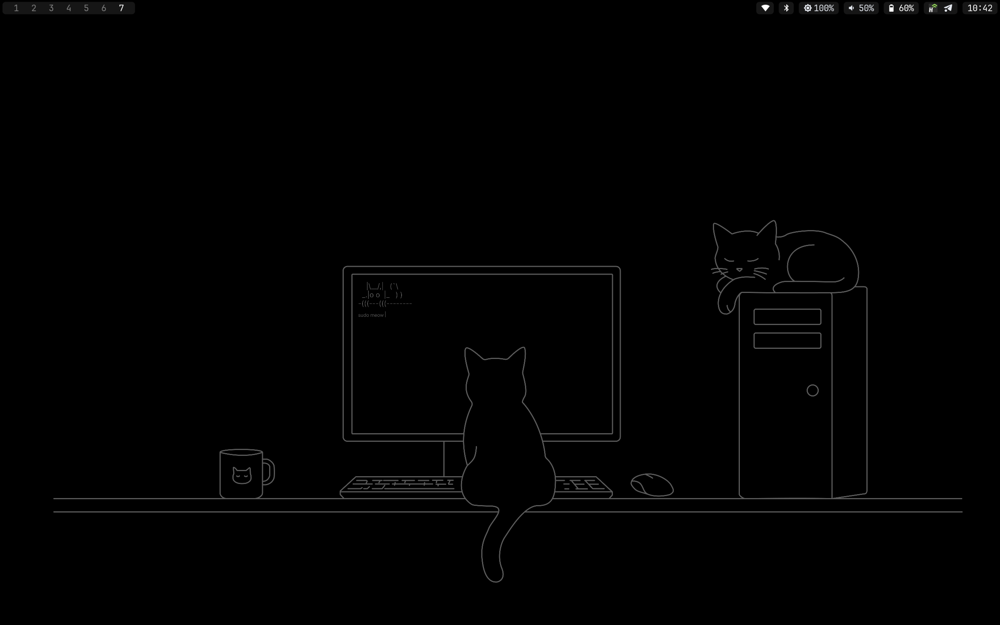

MY ARCH SETUP

If you use the feature once a month, you don't need it.

IF YOU STARED THIS REPO YOUR IQ WILL BE LOWER BY 10 POINTS

## PREVIEW

#### With quickshell

#### With waybar

!!!! `waybar 0.15.0 and below` + `hyprland 0.55` has a bug with switching desktops by clicking on a button on top bar.

### Required for quickshell:

- overskride (ui bluetooth)
- nmcli (wi-fi)
- hyprland (0.55 with lua config for workspaces)
- quickshell (0.3.0, maybe it`s will work on a later versions)
- love shit (very important)

- sensors, top, free (commands for system resources)

top bar have 3 segment:

- workspaces
- audio/music
- right
  - Processor usage in `%` (only displayed when greater than 70%)
  - Processor temperature in `C` (only displayed when greater than 70C)
  - Ram usage in `use/total GB`(only displayed when use greater than 26Gb (for me))
  - Battery
  - Time (clock)

click on the clock to open the side panel

### For Waybar

- just use
- overskride (ui bluetooth)
